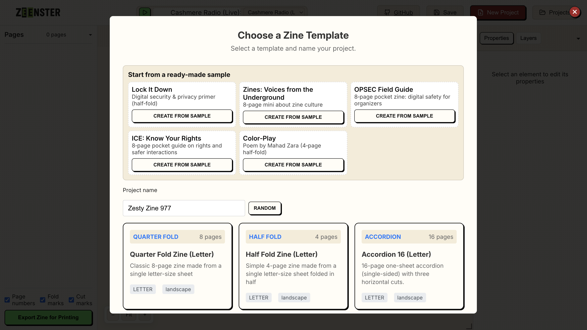

# Zine Maker

Professional zine design tool built with Vue 3, Vite, Konva.js (via vue-konva), and Pinia. Design page-by-page, manage layers, group and transform items, and export print-ready spreads for common zine formats.

🌐 **Live Demo**: [zeenster.com](https://zeenster.com)

Create printable zines directly in your browser with this professional design tool. No installation required - works on desktop and mobile devices.

## Screenshots

### Template Selection

*Choose from various zine formats including quarter-fold, half-fold, booklet, and accordion styles*

### Main Editor Interface  

*Three-pane editor with pages list, canvas, and properties panel - fully responsive design*

### Export & Print Ready

*Export high-resolution PNG and PDF files ready for printing with fold marks and cut guides*

## Highlights

- **Three‑pane editor**: Pages | Canvas | Properties
- **Design tools**: Select, Text, Image, Shape, Draw, Pan, Zoom
- **Smart selection**: marquee, multi-select, grouping, isolation mode, transformer handles
- **Layers panel**: reorder, lock, toggle visibility, group/ungroup
- **Templates & imposition**: quarter‑fold (slit zine), half‑fold, booklet (multi‑sheet) with front/back sides
- **Export**: hi‑res PNG sides and multi‑page PDF (jsPDF)
- **Persistence**: IndexedDB projects/assets + Projects modal
- **Mobile responsive**: Touch-optimized interface with collapsible panels
- **Theming**: CSS custom properties and dark mode

## Tech Stack

- **Framework**: Vue 3 + Vite + TypeScript
- **Canvas**: Konva.js + vue-konva
- **State**: Pinia
- **Persistence**: idb (IndexedDB)
- **PDF**: jsPDF
- **Utilities**: @vueuse/core, lodash-es, lucide-vue-next

## Quick Start

Prereqs: Node.js 18+, npm or pnpm

```bash
git clone https://github.com/virgilvox/zine-maker.git
cd zine-maker
npm install
npm run dev
# open http://localhost:5173
```

Production build:

```bash
npm run build
```

## Documentation

Comprehensive docs live in the `docs/` folder:

- docs/01-introduction.md
- docs/02-getting-started.md
- docs/03-user-guide.md
- docs/04-editor-and-tools.md
- docs/05-templates-and-export.md
- docs/06-persistence-and-projects.md
- docs/07-api-reference.md
- docs/08-contributing.md
- docs/09-faq.md
- docs/10-troubleshooting.md

Start with Getting Started and the User Guide:

- Getting Started: docs/02-getting-started.md
- User Guide: docs/03-user-guide.md

## Project Structure (key files)

```
src/
├── components/
│   ├── KonvaPageEditor.vue        # Canvas editor (selection, tools, transformer)
│   ├── PageList.vue               # Pages sidebar + export action
│   ├── properties/PropertiesPanel.vue
│   ├── ProjectsModal.vue          # Project manager (open/rename/delete)
│   └── ExportModal.vue            # PNG/PDF preview + download
├── stores/
│   ├── project.ts                 # Project/pages/content, history, grouping
│   ├── templates.ts               # Zine templates (formats, sizes)
│   ├── tools.ts                   # Active tool, drawing settings
│   └── ui.ts                      # UI state (panels, modals, export settings)
├── composables/
│   └── useZineExport.ts           # Imposition + PNG/PDF export
├── utils/
│   └── persistence.ts             # IndexedDB with idb
├── styles/
│   └── themes.css                 # Theme tokens
└── types/index.ts                 # Core types
```

## Keyboard Shortcuts

- V Select, T Text, I Image, S Shape, D Draw, H Pan, Z Zoom
- ⌘/Ctrl+Z Undo, ⌘/Ctrl+Shift+Z Redo
- Delete Remove selected
- Space Pan while held

## Contributing

See docs/08-contributing.md.

## License

MIT

